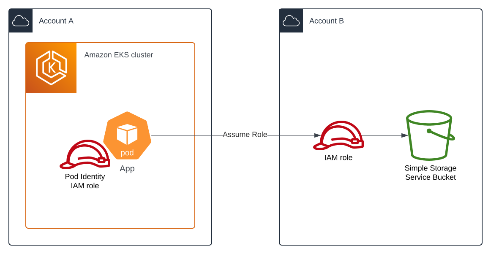

# epicac

Amazon EKS Pod Identity cross-account credentials

## Overview

`epicac` both provides and demonstrates the ability to perform cross-account access when using Amazon EKS Pod Identity. 

There are currently 3 possible ways to perform cross-account access with Amazon EKS Pod Identity:
1. Use resource based policies in the external accounts that allow the Pod Identity IAM role to access those resources. Support for this route will vary based on the service whether their APIs support this.
2. Use IAM role chaining within your application. Within your application, you would add code that performs the equivalent API call of [`aws sts assume-role --role-arn <value> --role-session-name <value>`](https://docs.aws.amazon.com/cli/latest/reference/sts/assume-role.html) in order to assume the IAM role in the external account.
3. Use IAM role chaining via the AWS credential provider chain by [sourcing credentials from an external process](https://docs.aws.amazon.com/cli/v1/userguide/cli-configure-sourcing-external.html).

`epicac` utilizes option 3.

  

## Solution

The solutions consists of x parts, assuming the IAM roles have been configured to allow the source account IAM role to assume the destination account IAM role, and the Amazon EKS Pod Identity association has been configured for the source account role (these are demonstrated in the example provided for reference):

1. The `epicac` executable is added to your application container
2. The `aws-config` configuration file is added to your application container. This uses the `credential_process` to retrieve credentials when assuming the IAM role in the destination account in a way that the AWS SDKs automatically understand (i.e. - this is automatically performing the role assumption on your behalf via the AWS SDK utilized by your application).
3. Your application manifest (or container image) is updated to supply environment variables for `AWS_CONFIG_FILE` and `AWS_PROFILE` so that the AWS SDK used by your application knows where to find the configuration file and which profile to use.

When configured, the overall process flow is as follows:

1. The application running inside the container makes an AWS API call (i.e. "list S3 buckets") using an AWS SDK
2. Per the AWS SDK, the SDK will perform its standard process of acquiring credentials via the default credentials provider chain. When doing so, the SDK will see the `AWS_*` environment variables within the container, both those that are injected by EKS Pod Identity as well as those supplied as part of this solution (`AWS_CONFIG_FILE` and `AWS_PROFILE`). 
3. Using the `AWS_PROFILE` and `AWS_CONFIG_FILE` environment variables, the SDK will attempt to use the profile specified in `AWS_PROFILE` that has been defined in configuration file specified in `AWS_CONFIG_FILE` to retrieve credentials.
4. The SDK will see that the configuration file specifies as `source_profile`, so it will jump over to that profile to retrieve credentials.
5. In the source profile, the SDK will see that the `credential_process` is defined, so it will execute that process to retrieve credentials. This is where the SDK is invoking the `epicac` executable to retrieve credentials. It can easily be replaced with another executable that performs the same operation, or you can even use common Linux tools like `curl` and `jq` to retrieve credentials (`curl -H "Authorization: $(cat $AWS_CONTAINER_AUTHORIZATION_TOKEN_FILE)" $AWS_CONTAINER_CREDENTIALS_FULL_URI | jq -c '{AccessKeyId: .AccessKeyId, SecretAccessKey: .SecretAccessKey, SessionToken: .Token, Expiration: .Expiration, Version: 1}'`).
6. Upon retrieving the credentials, the SDK will exit the source profile and return to the original (entrypoint) profile and assume the role defined under `role_arn`. This is where the assume role process is executed automatically by the SDK.
7. Finally, the default credential provider chain has reached completion and has resolved credentials from the assumed IAM role and the API call can be performed.

## Motivation

This project exists for primarily two reasons:

1. It demonstrates the process of performing cross-account role assumption using Amazon EKS Pod Identity so that users can better understand the overall process and replicate in their own environments
2. More importantly, it provides a minimalistic, purpose-built solution with little overhead to the application containers that can be used directly or indirectly (i.e. - use the provided executable, build it yourself, or replicate the code in the language of your choice) even in minimalistic container images such as [distroless](https://github.com/GoogleContainerTools/distroless) or [Chainguard](https://www.chainguard.dev/) where shells and common Linux tools are not available.
